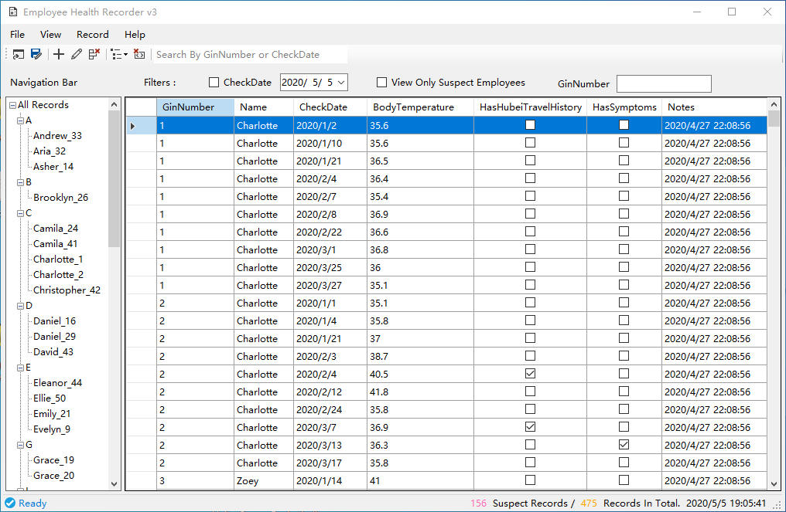
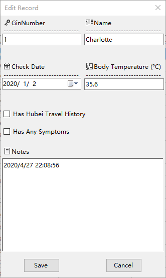

## Project: Daily Health Monitor Windows Application

#### Special Requirements:

- Cannot add new record which has conflict with existed records in case of
   - same ginNumber & same checkdate
   - same ginNumber but different name (ginNumber-name consistency)
- Cannot save edited record if:
  - has conflict with existed records
  - ginNumber or checkdate changed, and name is also changed (name can only be changed if ginNumber & checkdate are untouched.)

#### Screenshots:

/

#### Functions:

- Basic
  - Load Database From csv/txt file
  - Save Database to csv/txt file
  - Add new record
  - Edit selected record
  - Delete selected record
- Search & Filter
  - GinNumber
  - Check Date
  - Suspect records
  - Name through navigation siderbar
- GUI
  - Switch Treeview navigation sidebar
  - Context menus inside navigation sidebar and datagrid table
  - Working status auto-update & records statistics in status bar
  - key shortcuts & access key support

#### To do:
- [ ] Search textbox function
- [ ] EditHistory property in record
- [ ] Improve datagrid table and treeview sidebar redraw speed when database is large
- [ ] "About" form (TBC)