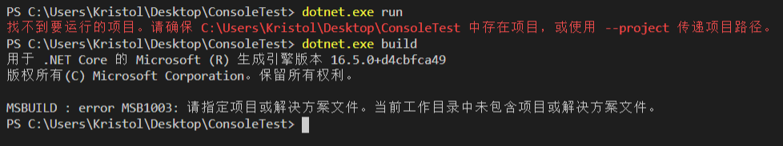

- [`readonly` vs `const`](#readonly-vs-const)
  - [What is the difference between const and readonly in C#?](#what-is-the-difference-between-const-and-readonly-in-c)
  - [\<Effective Csharp\> Item 2](#effective-csharp-item-2)
  - [Const vs Static vs Readonly in C#](#const-vs-static-vs-readonly-in-c)
- [如何组织你的文件和项目？](#%e5%a6%82%e4%bd%95%e7%bb%84%e7%bb%87%e4%bd%a0%e7%9a%84%e6%96%87%e4%bb%b6%e5%92%8c%e9%a1%b9%e7%9b%ae)
  - [Purpose of Solution Files](#purpose-of-solution-files)
  - [为已有项目添加测试](#%e4%b8%ba%e5%b7%b2%e6%9c%89%e9%a1%b9%e7%9b%ae%e6%b7%bb%e5%8a%a0%e6%b5%8b%e8%af%95)
  - [Solutions and Projects](#solutions-and-projects)


---

## `readonly` vs `const`

- `const`常量局限于数字和字符串类型，而`readonly`常量可以任何类型。
- `const`常量相当于一个数字或字符串的别名，在代码编译后`const`常量的位置被数字或字符串取代了；而`readonly`常量的引用依然存在，这样做的好处就是当当前程序集中的常量处理操作改变时，对其存在引用的其他程序集中无需重新编译，因为编译后的结果是不变的，而对于const常量来说，则需要重新编译，因为需要修改为新的值。
  - 这类似于书上对于使用属性还是公共字段的代码实践推荐 p97
- 使用`const`常量的好处就是速度，但丢失了`readonly`常量的灵活性。在代码版本更新过程中不会发生改变的变量可以使用`const`。


### [What is the difference between const and readonly in C#?](https://stackoverflow.com/a/56024)

Consider a class defined in `AssemblyA`.

```csharp
public class Const_V_Readonly
{
  public const int I_CONST_VALUE = 2;
  public readonly int I_RO_VALUE;
  public Const_V_Readonly()
  {
     I_RO_VALUE = 3;
  }
}
```
`AssemblyB` references `AssemblyA` and uses these values in code. When this is compiled,

  in the case of the `const` value, it is like a find-replace, the value 2 is 'baked into' the `AssemblyB`'s IL. This means that if tomorrow I'll update `I_CONST_VALUE` to 20 in the future. `AssemblyB` would still have 2 till I recompile it.
  in the case of the `readonly` value, it is like a ref to a memory location. The value is not baked into `AssemblyB`'s IL. This means that if the memory location is updated, `AssemblyB` gets the new value without recompilation. So if `I_RO_VALUE` is updated to 30, you only need to build `AssemblyA`. All clients do not need to be recompiled.

So if you are confident that the value of the constant won't change use a `const`.

```csharp
public const int CM_IN_A_METER = 100;
```

But if you have a constant that may change (e.g. w.r.t. precision).. or when in doubt, use a `readonly`.


```csharp
public readonly float PI = 3.14;
```

### \<Effective Csharp\> Item 2

Compile-time constants are limited to numbers and strings.
Runtime constants can be any type. 
You must initialize them in a constructor, or you can use an initializer. 
You can make `readonly` values of the `DateTime` structures; you cannot create `DateTime` values with `const`.

The IL generated when you reference a `readonly` constant references the `readonly` variable, not the value.
Compile-time constants generate the same IL as though you’ve used the numeric constants in your code, even across assemblies: A constant in one assembly is still replaced with the value when used in another assembly.

Updating the value of a public constant should be viewed as an interface change.
You must recompile all code that references that constant. 
Updating the value of a read-only constant is an implementation change; it is binary compatible with existing client code.

The final advantage of using `const` over `readonly` is performance: Known constant values can generate slightly more efficient code than the variable accesses necessary for `readonly` values. 
However, any gains are slight and should be weighed against the decreased flexibility. 
Be sure to profile performance differences before giving up the flexibility.


### [Const vs Static vs Readonly in C#](https://exceptionnotfound.net/const-vs-static-vs-readonly-in-c-sharp-applications/)

- If you know the value will never, ever, ever change for any reason, use `const`.
- If you're unsure of whether or not the value will change, but you don't want other classes or code to be able to change it, use `readonly`.
- If you need a field to be a property of a type, and not a property of an instance of that type, use `static`.
A `const` value is also implicitly `static`.


---

## 如何组织你的文件和项目？

通俗来说，项目是所有用于编译生成可执行文件、包或网站等所需文件的集合，这些文件包括源代码、图片、数据文件等。

无论是 `VS` 还是 `netcore` 的命令行编译，都借助于 [MSBuild](https://docs.microsoft.com/en-us/visualstudio/msbuild/msbuild?view=vs-2019)（本文仅考虑默认的对于C#项目的编译）工具，因此在每个项目中也会包含一个 `.csproj` 文件扩展名的XML文档，其存储了所有 `MSBuild` 需要的用于编译项目的信息，包括哪些是待编译的源码，数据，什么样的编译参数与设定等等。

更多的关于 `.csproj` 文件的技术资料可参考：
- [MSBuild project file schema reference](https://docs.microsoft.com/en-us/visualstudio/msbuild/msbuild-project-file-schema-reference?view=vs-2019)
- [Understanding the project file](https://docs.microsoft.com/en-us/aspnet/web-forms/overview/deployment/web-deployment-in-the-enterprise/understanding-the-project-file)
- [Walkthrough: Create an MSBuild project file from scratch](https://docs.microsoft.com/en-us/visualstudio/msbuild/walkthrough-creating-an-msbuild-project-file-from-scratch?view=vs-2019)

事实上，如果没有这个XML文档，之前的文件集合只能称为包含源码和数据的文件夹，而不能成为真正的项目，也不能在当前目录中运行 `dotnet run/build` 等命令:




新建项目可通过 `dotnet new <template> -o <project-name>` 命令快速实现。
这里的template指所需新建项目的类型，如命令行应用(`console`)，类库(`classlib`)，xunit测试(`xunit`)等。
事实上，`dotnet new` 命令会调用本机已安装的模板，不止包括项目类型模板，还可包括配置文件模板，解决方案模板，以及自定义模板，具体可参考[链接](https://docs.microsoft.com/en-us/dotnet/core/tools/dotnet-new)，或通过命令`dotnet new --list`获取。

- `dotnet list reference` 可列出当前项目所有引用的其他项目。
- `dotnet add/remove reference <other-project-name>.csproj` 可为当前项目添加/移除其他项目的引用。

当我们想要创建和管理一个大型项目，该项目下同时包含有多个项目存在并且项目之间相互联系时，新建一个文件夹并把这些项目都移动进去，并通过项目之间添加reference是个可行的做法。

例如现在有一个排序算法库(`classlib`)的项目，有一个针对此库的测试(`xunit`)项目，并有一个命令行(`console`)应用的项目可以调用排序算法进行使用，新建一个大文件夹把他们都放在一起。


当我们为测试项目和命令行项目都添加了排序算法库的引用（测试项目和命令行项目的文件目录下分别运行 `dotnet add reference ../SortMethod/SortMethod.csproj` ），处理命令行应用时在ConsoleApp文件目录下运行 `dotnet run` 命令，进行测试时在SortMethodTests文件目录下运行 `dotnet test` 命令，编译排序算法库时在SortMethod文件目录下进行 `dotnet build` 命令，这些操作都是没有问题的。

另外，在某些时候，如果想一次性同时进行排序算法库的编译，测试的进行及console服务的运行，可以通过创建脚本等方式实现。

但一种更便利的方式是通过 `solution(.sln) file`。
通过 `dotnet new sln -o <solution-name>` 命令在文件夹中建立解决方案（`solution-name.sln`），并将各相关项目加入到该解决方案中，这样sln文件便充当了虚拟文件夹的角色，将各个项目集中整合了起来，为项目的编译和部署发布阶段提供很多的便利。
例如，运行 `dotnet build` 命令即可一次性编译所有的projects，这在通过命令行执行编译时会十分地方便，否则我们只能对每个project分别编译。
另外，也可以通过sln文件对所有项目的编译进行统一的配置。


- `dotnet sln list` 命令可列出解决方案中的所有项目。
- `dotnet sln add/remove <project-name>.csproj` 命令可为解决方案添加或移除项目。

More readings:
- [How to Bootstrap and Create .NET Projects](https://www.toptal.com/dot-net/bootstrap-and-create-dot-net-projects)


### [Purpose of Solution Files](https://stackoverflow.com/questions/43426982/dotnet-core-purpose-of-solution-files)

Solution file works as container for application's project/projects. It comes handy when you are working on your application out of IDE. Following are some of uses of solution file.

- Open project or multiple projects in IDE just by opening solution file in IDE. e.g. If you open solution file in visual studio then all of projects which are part of solution will get opened in visual studio.
- You can control build/deployment of projects (what to build and what not to) under solution using solution level configuration.
- If you are using editor like VS Code then solution file facilitate to build all those project which are part of solution just by running "dotnet build" command. If projects were not part of solution then you need to build them individually.
- When working out of IDE (like Visual Studio) and source control you can add all project files and solution to source control just by adding solution to source control. Same goes with check in or checkout.

These are some of advantages of solution file and there can be many more. However solution file is not must have thing and you can still live without it. Its just makes developer's life easy and improves productivity.


### 为已有项目添加测试

[Walkthrough: Create and run unit tests for managed code](https://docs.microsoft.com/en-us/visualstudio/test/walkthrough-creating-and-running-unit-tests-for-managed-code?view=vs-2019)

对于一个已有项目，要为它添加测试(使示例用xunit测试框架)，可通过 `dotnet new xunit -o <test-project-name>` 创建新的测试项目，并在测试项目目录下通过 `dotnet add reference <project-to-test-name.csproj>` 命令为测试项目添加对待测试项目的引用。
在完成相关的测试代码编写后，在测试项目目录下运行 `dotnet test` 命令即可启动测试。

对于测试文件的目录处理问题，一个常见的想法是测试的文件可以放在待测试项目文件夹下，看作是待测试项目的一部分：


但这样做会使得我们在试图编译待测试项目时失败，因为默认的编译文件是当前目录下的所有文件，这就包括了测试代码，而测试代码的编译时需要待测试项目的编译结果的，这就成了`先生鸡还是先生蛋`的问题。

为了解决这个问题，可以在待测试项目的csproj文件中加入对测试目录不编译的设定:


这样的操作之后我们可以对待测试项目进行编译，也能对测试项目进行运行了。

但这样为了使得测试正常运行而手动修改csproj的做法十分不值得推荐。事实上，我们完全可以将待测试项目目录和测试项目目录设为并行关系，如下图示例：


这样的话我们可以直接正常的对待测试项目进行编译，也可以直接在测试项目目录下运行测试。

More readings:
- [Walkthrough: Test-driven development using Test Explorer](https://docs.microsoft.com/en-us/visualstudio/test/quick-start-test-driven-development-with-test-explorer?view=vs-2019)
- [Testing with Visual Studio](https://docs.microsoft.com/en-us/visualstudio/test/?view=vs-2019)
- [Unit testing C# in .NET Core using dotnet test and xUnit](https://docs.microsoft.com/en-us/dotnet/core/testing/unit-testing-with-dotnet-test)


### Solutions and Projects

A `Solution` is a container for all your projects that belong together. 
It’s used to group related `Projects` together, but it’s possible to reference from a `Project` in a `Solution` to a `Project` in another `Solution`.
By using a `Solution`, it’s easy to configure settings for all the projects.

A solution is described by a text file (extension .sln) with its own unique format; it's not intended to be edited by hand.

Note: `Workspaces` are used to group solutions together, but putting your solutions in the same workspace doesn’t give you additional functionality, so it doesn’t affect your dependencies, references…

Visual Studio uses [MSBuild](https://docs.microsoft.com/en-us/visualstudio/msbuild/msbuild?view=vs-2019) to build each project in a solution, and each project contains an MSBuild project file. 
The file extension reflects the type of project, for example, a C# project (`.csproj`), a Visual Basic project (`.vbproj`), or a database project (`.dbproj`). 
The project file is an XML document that contains all the information and instructions that MSBuild needs in order to build your project, including the content, platform requirements, versioning information, web server or database server settings, and the tasks to perform.

Although not strictly necessary from a pure development perspective, we don’t necessarily need solution files when developing with VS Code, but solution files do come in handy during the Build and Release phases of projects, so it is generally good practice to start thinking about using them in the early stages of your project development.

References:
- [Manage and Edit soluton files with visual studio code and .net CLI](https://garywoodfine.com/creating-editing-solution-files-dotnet-core-ubuntu/)
- [Solutions and projects in Visual Studio](https://docs.microsoft.com/en-us/visualstudio/ide/solutions-and-projects-in-visual-studio?view=vs-2019)

---

