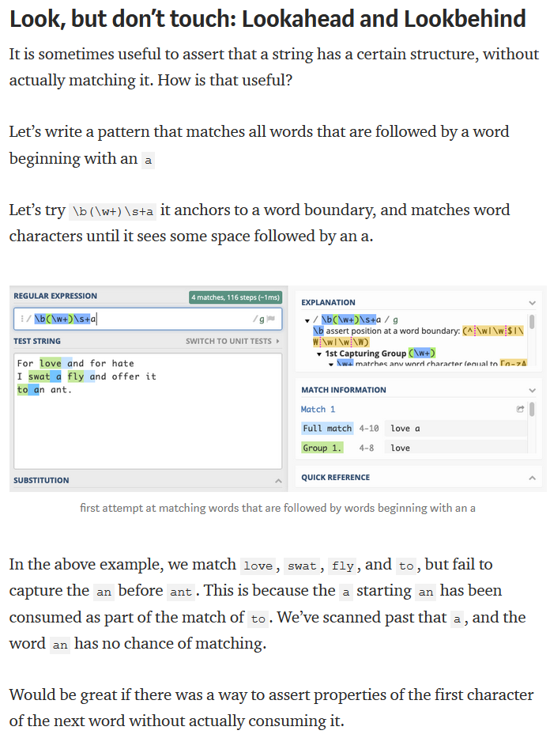

- [Non-Capturing Groups](#non-capturing-groups)
- [Atomic Groups](#atomic-groups)
- [Lookaround: Look, but don’t touch](#lookaround-look-but-dont-touch)
- [Limitations of Regular Expressions](#limitations-of-regular-expressions)
- [Question](#question)

The [`Regex`](https://docs.microsoft.com/en-us/dotnet/api/system.text.regularexpressions.regex?view=netframework-4.8) class represents the `.NET Framework`'s regular expression engine. It can be used to quickly parse large amounts of text to **find specific character patterns**; to **extract, edit, replace, or delete text substrings**; and to **add the extracted strings to a collection** to generate a report.

- verify the structure of strings
- extract substrings form structured strings
- search / replace / rearrange parts of the string
- split a string into tokens

To use regular expressions, you define the pattern that you want to identify in a text stream by using the syntax documented in [Regular Expression Language - Quick Reference](https://docs.microsoft.com/en-us/dotnet/standard/base-types/regular-expression-language-quick-reference?view=netframework-4.8). Next, you can optionally instantiate a `Regex` object. Finally, you call a method that performs some operation, such as replacing text that matches the regular expression pattern, or identifying a pattern match.

**Note:**
If your primary interest is to **validate a string by determining whether it conforms to a particular pattern**, you can use the [`System.Configuration.RegexStringValidator`](https://docs.microsoft.com/en-us/dotnet/api/system.configuration.regexstringvalidator?view=netframework-4.8) class.

### Non-Capturing Groups

Non-capturing groups match exactly the way normal groups do. However, they do not make their matched content available. If there’s no need to capture the content, they can be used to improve matching performance. Non-capturing groups are written as: `(?:pattern)`

### Atomic Groups

There is also a fast-performing version of a non-capturing group, that does not support backtracking. It is called the “independent non-capturing group” or “atomic group”.

It is written as `(?>pattern)`

An atomic group is a non-capturing group that can be used to optimize pattern matching for speed. Typically it is supported by regex engines that also support possessive quantifiers.

Its behavior is also similar to possessive quantifiers: once an atomic group has matched a part of the string, that first match is permanent. The group will never try to re-match in another way to accommodate other parts of the pattern.

`a(?>bc|b)c` matches `abcc` but it does not match `abc`.

The atomic group’s first successful match is on bc and it stays that way. A normal group would re-match during backtracking to accommodate the c at the end of the pattern for a successful match. But an atomic group’s first match is permanent, it won’t change.

This is useful if you want to match as fast as possible, and don’t want any backtracking to take place anyway.

### Lookaround: Look, but don’t touch

### [Limitations of Regular Expressions](https://towardsdatascience.com/everything-you-need-to-know-about-regular-expressions-8f622fe10b03)

Arriving at the end of this article you may feel that all possible string parsing problems can be dealt with, once you get regular expressions under your belt.

Well, no.

This article introduces regular expressions as a shorthand notation for sets of strings. 
If you happen to have the exact regular expression for zip codes, you have a shorthand notation for the set of all strings representing valid zip codes. 
You can easily test an input string to check if it is an element of that set. There is a problem however.

    There are many meaningful sets of strings for which there is no regular expression!

The set of valid JavaScript programs has no regex representation, for example. 
There will never be a regex pattern that can check if a JavaScript source is syntactically correct.

This is mostly due to regex’ inherent inability to deal with nested structures of arbitrary depth. 
Regular expressions are inherently non-recursive. 
XML and JSON are nested structures, so is the source code of many programming languages. 
Palindromes are another example— words that read the same forwards and backwards like racecar — are a very simple form of nested structure. 
Each character is opening or closing a nesting level.
If yor input can arbitrarily nest like JavaScript, you can’t validate it with Regular Expressions alone. 

You can construct patterns that will match nested structures up to a certain depth but you can’t write a pattern that matches arbitrary depth nesting.

When working with regular expressions, the trade-off between complexity, maintainability, performance, and correctness should always be a conscious decision. 
After all, a regex pattern is as “write-only” as computing syntax can get. 
It is difficult to read regular expression patterns correctly, let alone debug and extend them.

My advice is to embrace them as a powerful string processing tool, but to neither overestimate their possibilities, nor the ability of human beings to handle them.

When in doubt, consider reaching for another hammer in the box.

### Question

1. When to use regex, and when to write a method ?  => when not to use regex?
2. complex and long regex expression ?

To read:
- [Everything you need to know about Regular Expressions](https://towardsdatascience.com/everything-you-need-to-know-about-regular-expressions-8f622fe10b03)
- [Regular Expressions: Now You Have Two Problems](https://blog.codinghorror.com/regular-expressions-now-you-have-two-problems/)